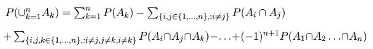

## Algunas Propiedades Elementales

**1)** Si A es cualquier evento, entonces,  

* $P(A) \leq 1$  y  
* $P(A^c) = 1 − P(A)$


**2)** Complemento de conjunto vacio / Evento imposible  

* $P(\theta) = 0$

**3)** Si A y B son eventos tales que A ⊂ B entonces,

* P(B − A) = P(B) − P(A)

**4)** Si A y B son eventos tales que A ⊂ B, entonces,   

* P(A) ≤ P(B).

**5)** Propiedad de la aditividad finita: Sean $A_1$,..., $A_n$ n eventos mutuamente excluyentes, entonces,

* $P (\bigcup_{k=1}^n A_k) = \Sigma_{k=1}^n P(A_k)$.

De manera general, el método para asignar probabilidades a los eventos relativos a cualquier experimento aleatorio va de lo simple a lo complejo: primero se encuentra la probabilidad de una clase particular de eventos y, a partir de ahí, utilizando las propiedades de la función de probabilidad, se extiende ésta a una clase más amplia de eventos y después a familias cada vez más extensas.

**6)** Subaditividad finita o desigualdad de Boole, Sean $A_1$,... $A_n$ n eventos, entonces, 

* $P(\bigcup_{k=1}^n A_k) \leq \Sigma_{k=1}^n P(A_k)$

**7)** Regla de la suma para 2 eventos, Si A y B son dos eventos cualesquiera, entonces: 

* $P(A \cup B) = P(A) + P(B) − P(A \cap B)$  


**8)** Regla de la suma para n eventos, Sean $A_1$,..., $A_n$ n eventos cualesquiera, entonces:



## Ejercicio

Dos eventos A y B son tales que

    * P(A) = 0.3, 
    * P(B) = 0.4 y
    * P(A ∩ B) = 0.1. 

Encuentre la probabilidad de que 

    a) ocurra exactamente uno de los dos eventos A y B y 
    b) no ocurra ninguno de los dos eventos.

### Solución
A)  
$P(A - A \cap B) + P(B - A \cap B)$  
  (0.3 - 0.1) + ( 0.4 - 0.1)
```{r}
P_A <- 0.3
P_B <- 0.4
P_A_inter_B <- 0.1

result <- (P_A - P_A_inter_B) + (P_B - P_A_inter_B)

sprintf("Result: %f",result)
```

B)  
$ P(A \cup B)^c = 1 - P(A \cup B) = 1 - P(A) - P(B) + P(A \cap B)$  

```{r}
result <- 1 - P_A - P_B + P_A_inter_B
sprintf("Result: %f",result)
```


## Elecciones al azar y resultados equiprobables

La **elección al azar** se refiere a experimentos aleatorios en los cuales se dispone de una colección de objetos, los cuales pueden ser bolas, cajas, tarjetas, personas, etc., y se define el experimento aleatorio precisamente como la elección al azar de uno o varios objetos de la colección.  

Al considerar el experimento aleatorio consistente en **“elegir al azar”** uno o varios objetos de la colección, los posibles resultados del experimento deberán tener asignada la misma probabilidad, en cuyo caso diremos que los posibles resultados son **equiprobables**. De aquí que, en realidad, el término “elección al azar” es sinónimo de equiprobabilidad  


Un experimento aleatorio puede estar compuesto por dos o más experimentos definidos como elecciones al azar y en algunos casos la equiprobabilidad se da únicamente parcialmente, esto puede ser suficiente para determinar la probabilidad de cada uno de los posibles resultados del experimento compuesto. Esto resuelve nuestro problema pues una vez asignada una probabilidad a cada evento elemental, la probabilidad de cualquier evento compuesto por un número finito de eventos elementales se puede calcular, gracias a la propiedad de la aditividad finita, simplemente sumando las probabilidades de los eventos elementales que lo componen.  


**Los posibles resultados de un experimento aleatorio pueden resultar equiprobables.**  

### Definición clásica de probabilidad  

* P(A) = (# de eventos elementales que producen a ocurrencia de A) / (# total de eventos elementales)

**Debe tenerse presente que esta manera de calcular probabilidades puede aplicarse únicamente cuando se ha determinado que los posibles resultados del experimento aleatorio son equiprobables.**  

#### Problema

Una primera urna contiene 2 bolas rojas y 4 blancas; una segunda urna contiene 8 bolas rojas y 7 blancas; y una tercera urna contiene 6 bolas rojas y 4 blancas. Un experimento aleatorio consiste de dos partes, en la primera parte se selecciona una urna al azar y en la segunda parte se selecciona al azar una bola de la urna elegida en la primera parte. ¿Cuál es la probabilidad de que se seleccione una bola roja?  

**Solución**

Hay dos partes, 

*Primer parte*  
La seleccion de la urna, que son 3, luego entonces,  $P(A_i) = \frac{1}{3} $

*Segunda parte*
Ver la probabilidad de seleccionar la bola roja de acuerdo a la urna seleccionada

$P(A_1) = \{R1, R2, B1, B2, B3, B4 \} $
$P(A_2) = \{R3, R4, R5, R6, R7, R8, R9, R10, B5, B6, B7, B8, B9, B10, B11 \} $
$P(A_3) = \{R11, R12, R13, R14, R15, R16, B12, B13, B14, B15 \} $

Entonces:  
Siendo $p_i$ la probabilidad de agarrar una bola

$ \frac{1}{3} = P(A_1) = 6p_1 $ 
$ \frac{1}{3} = P(A_2) = 15p_2 $
$ \frac{1}{3} = P(A_3) = 10p_3 $

Despejando: 
$ p_1 = \frac{1}{3} / \frac{1}{6}$
$ p_2 = \frac{1}{3} / \frac{1}{15} $
$ p_3 = \frac{1}{3} / \frac{1}{10} $
```{r}
resultp1 <- (1/3)/(18/3)
sprintf("p1: 1/18 (%f)", resultp1)
resultp2 <- (1/3)/(45/3)
sprintf("p2: 1/45 (%f)", resultp2)
resultp3 <- (1/3)/(30/3)
sprintf("p3: 1/30 (%f)", resultp3)
```

Luego entonces, sustituyendo con la cantidad de bolas rojas  
$ P(B) = \frac{2}{18} + \frac{8}{45} + \frac{6}{30} $
```{r}
result <- resultp1 * 2 + resultp2 * 8 + resultp3 * 6
sprintf("Probabilidad: (22/45) %f", result)
```

## Probabilidad Condicional

En ocasiones un experimento aleatorio está compuesto por varios experimentos, también aleatorios, los cuales se realizan uno después del otro. Un ejemplo típico de esta situación se obtiene al considerar n elecciones sucesivas, todas ellas al azar, de elementos de una determinada población. El resultado de cada parte puede ser independiente o depender de las partes anteriores. En general en estos casos lo que se tiene a la mano para iniciar el proceso de calcular probabilidades son probabilidades de eventos relativos a cada parte del experimento, condicionadas a lo que haya ocurrido en las primeras partes. Este tipo de probabilidades es conocido con el nombre de **probabilidades condicionales**.  

**Ejemplo**
Una urna contiene 3 bolas rojas y 6 bolas negras. Un experimento aleatorio consiste en dos partes, en la primera, se selecciona al azar una bola de la urna y se deja fuera de ésta, en la segunda, se selecciona al azar una de las bolas restantes en la urna. Denotemos por $B_1, B_2, B_3, B_4, B_5, B_6, B_7, B_8, B_9$ las 9 bolas de la urna. Cada posible resultado del experimento aleatorio puede entonces representarse mediante una pareja ($B_i, B_j$), con i $\neq$ j, en donde $B_i$ representa el resultado de la primera elección y $B_j$ el de la segunda. El espacio muestral consta así de 72 elementos.

Como la elección de la primera bola se realiza al azar, cualquiera de las bolas en la urna tiene la misma probabilidad de ser elegida, de manera que si, para i ∈ {1,..., 9}, definimos los siguientes eventos:   

$B_1^i$ : En la primera elección se obtiene la bola $B_i$, se tiene:

$$
B_i^1 = \{ (B_i,B_1),(B_i,B_2),... (B_i,B_{i-1}),(B_i,B_{i+1}),...(B_i,B_9)  \}
$$  

y $P(B_i^1) = \frac{1}{9}$ para toda i  

Por otra parte, una vez seleccionada la primera bola, la elección de la segunda se realiza también al azar, de manera que todas las bolas restantes tienen la misma probabilidad de ser elegidas. Esto significa que, para cada i ∈ {1,..., 9}, las probabilidades de cada uno de los 8 posibles resultados que componen el evento $B_1$ i, son iguales. Con esta información se puede obtener la probabilidad de cada uno de los posibles resultados del experimento pues siendo 8 los elementos que componen cada $B_1^i$ , teniendo todos ellos la misma probabilidad y la suma de ellas siendo igual a $\frac{1}{9}$, se concluye que la probabilidad de cada uno de ellos es $\frac{1}{72}$.   

Así se puede definir: 
$$
P(B_j^2 | B_i^1) = \frac{1}{8} para j \in \{1,\dots,9 \} j \neq i
$$

Por lo que se ve que :

$P(B_i^1)$ y $P(B_j^2 | B_i^1)$ es posible obtener $P(B_i^1 \cap B_j^2) = P(B_i,B_j)$  


**Generalizando**

Dado que el evento A ocurre, un evento B ocurre si y sólo si ocurre $A \cap B$, es decir, se debe de tener $P(B | A) = P(A \cap B | A)$, de manera que el problema se reduce a determinar cuál es la probabilidad de un subconjunto del espacio muestral restringido, con relación a éste.


*Probabilidad condicional* Sean A y B dos eventos y supongamos P(A) > 0, se define la probabilidad condicional de B, dada la ocurrencia de A, P(B|A), mediante la fórmula:

$$
P(B|A) =\frac{P(A \cap B)}{P(A)}
$$

*Probabilidad conditional* de dos subeventos excluyentes

$$
P(B \cup C | A) = P(B | A) + P(C | A)
$$


## Regla del producto

La definición de probabilidad condicional puede utilizarse en dos sentidos diferentes; por un lado, se puede utilizar de manera directa para calcular la probabilidad de un evento B, dado que ocurre algún otro evento A, es decir, con respecto a un espacio muestral reducido; por otro lado, la definición puede expresarse en la forma siguiente relación:


$$
P(A \cap B) = P(B|A)P(A)
$$

**Esta forma, si bien expresa exactamente la misma relación que la forma original, se aplica en un sentido muy distinto pues permite calcular la probabilidad de una intersección de eventos en aquellos casos en que la probabilidad condicional de la fórmula puede obtenerse de manera directa.**

**Regla del producto**: Sean $A_1$,..., $A_n$ n eventos tales que $P(A_1 \cap \dots \cap A_{n−1}) > 0$, entonces:  
$$
P(\bigcap_{k=1}^n A_k) = P(A_n|A_1 \cap \dots \cap A_{n−1}) \dots P(A_2|A_1)P(A1)
$$

## Independencia estocástica

$$
P(B|A) = P(B)
$$

$$
P(A \cap B) = P(A|B)P(B) = P(A)P(B)
$$

**Independencia de 2 eventos**: Se dice que dos eventos A y B son estocásticamente independientes si

$$
P(A \cap B) = P(A)P(B)
$$

**Independencia de n eventos** Se dice que n eventos $A_1$, ..., $A_n$ son estocásticamente independientes si dada cualquier subcolección de ellos, $A_{j1}$ ,..., $A_{jm}$, con 1 ≤ $j_1$ < ··· < $j_m$, se tiene:

$$
P(A_{j1} \cap \dots \cap A_{jm}) = P(A_{j1} ) \dots P(A_{jm})
$$


## Interpretación objetiva y subjetiva de la probabilidad


Cabe en este momento hacer énfasis en el sentido objetivo que hemos dado a la probabilidad de un evento en los ejemplos considerados hasta este momento. Al construir un modelo para un determinado experimento aleatorio, hemos buscado que la probabilidad de un evento exprese determinadas propiedades objetivas del experimento aleatorio. Así, cuando decimos que la probabilidad de obtener el resultado 5 al lanzar un dado es 1/6, queremos expresar con eso que las características del experimento consistente en lanzar un dado son tales que el lanzamiento del dado equivale a seleccionar al azar un número entre 1 y 6 y entonces se puede construir el modelo basándonos en la equiprobabilidad de los posibles resultados. La objetividad en la asignación de probabilidades tiene sentido pues para nosotros un experimento es aleatorio no porque desconozcamos cual resultado se va a obtener, sino porque efectivamente caben varias posibilidades en cuanto al resultado, de acuerdo a como fue planteado en la sección I.1. En otras palabras, la aleatoriedad del experimento es objetiva. No es éste el único enfoque que existe en el cálculo de probabilidades, también se puede desarrollar éste desde un enfoque subjetivo. Un ejemplo aclarará la diferencia entre dicho enfoque y el que seguimos en este libro.


