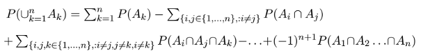

Las Reglas Básicas
================

Algunas Propiedades Elementales
-------------------------------

**1)** Si A es cualquier evento, entonces,

-    \leq 1") y
-    = 1 − P(A)")

**2)** Complemento de conjunto vacio / Evento imposible

-    = 0")

**3)** Si A y B son eventos tales que A ⊂ B entonces,

-   P(B − A) = P(B) − P(A)

**4)** Si A y B son eventos tales que A ⊂ B, entonces,

-   P(A) ≤ P(B).

**5)** Propiedad de la aditividad finita: Sean ,...,  n eventos mutuamente excluyentes, entonces,

-    = \Sigma_{k=1}^n P(A_k)").

De manera general, el método para asignar probabilidades a los eventos relativos a cualquier experimento aleatorio va de lo simple a lo complejo: primero se encuentra la probabilidad de una clase particular de eventos y, a partir de ahí, utilizando las propiedades de la función de probabilidad, se extiende ésta a una clase más amplia de eventos y después a familias cada vez más extensas.

**6)** Subaditividad finita o desigualdad de Boole, Sean ,...  n eventos, entonces,

-    \leq \Sigma_{k=1}^n P(A_k)")

**7)** Regla de la suma para 2 eventos, Si A y B son dos eventos cualesquiera, entonces:

-    = P(A) + P(B) − P(A \cap B)")

**8)** Regla de la suma para n eventos, Sean ,...,  n eventos cualesquiera, entonces:



Ejercicio
---------

Dos eventos A y B son tales que

    * P(A) = 0.3, 
    * P(B) = 0.4 y
    * P(A ∩ B) = 0.1. 

Encuentre la probabilidad de que

    a) ocurra exactamente uno de los dos eventos A y B y 
    b) no ocurra ninguno de los dos eventos.

### Solución

1.   + P(B - A \cap B)")
    (0.3 - 0.1) + ( 0.4 - 0.1)

``` r
P_A <- 0.3
P_B <- 0.4
P_A_inter_B <- 0.1

result <- (P_A - P_A_inter_B) + (P_B - P_A_inter_B)

sprintf("Result: %f",result)
```

    ## [1] "Result: 0.500000"

1.  $ P(A B)^c = 1 - P(A B) = 1 - P(A) - P(B) + P(A B)$

``` r
result <- 1 - P_A - P_B + P_A_inter_B
sprintf("Result: %f",result)
```

    ## [1] "Result: 0.400000"

Elecciones al azar y resultados equiprobables
---------------------------------------------

La **elección al azar** se refiere a experimentos aleatorios en los cuales se dispone de una colección de objetos, los cuales pueden ser bolas, cajas, tarjetas, personas, etc., y se define el experimento aleatorio precisamente como la elección al azar de uno o varios objetos de la colección.

Al considerar el experimento aleatorio consistente en **“elegir al azar”** uno o varios objetos de la colección, los posibles resultados del experimento deberán tener asignada la misma probabilidad, en cuyo caso diremos que los posibles resultados son **equiprobables**. De aquí que, en realidad, el término “elección al azar” es sinónimo de equiprobabilidad

Un experimento aleatorio puede estar compuesto por dos o más experimentos definidos como elecciones al azar y en algunos casos la equiprobabilidad se da únicamente parcialmente, esto puede ser suficiente para determinar la probabilidad de cada uno de los posibles resultados del experimento compuesto. Esto resuelve nuestro problema pues una vez asignada una probabilidad a cada evento elemental, la probabilidad de cualquier evento compuesto por un número finito de eventos elementales se puede calcular, gracias a la propiedad de la aditividad finita, simplemente sumando las probabilidades de los eventos elementales que lo componen.

**Los posibles resultados de un experimento aleatorio pueden resultar equiprobables.**

### Definición clásica de probabilidad

-   P(A) = (\# de eventos elementales que producen a ocurrencia de A) / (\# total de eventos elementales)

**Debe tenerse presente que esta manera de calcular probabilidades puede aplicarse únicamente cuando se ha determinado que los posibles resultados del experimento aleatorio son equiprobables.**

#### Problema

Una primera urna contiene 2 bolas rojas y 4 blancas; una segunda urna contiene 8 bolas rojas y 7 blancas; y una tercera urna contiene 6 bolas rojas y 4 blancas. Un experimento aleatorio consiste de dos partes, en la primera parte se selecciona una urna al azar y en la segunda parte se selecciona al azar una bola de la urna elegida en la primera parte. ¿Cuál es la probabilidad de que se seleccione una bola roja?

**Solución**

Hay dos partes,

*Primer parte*
La seleccion de la urna, que son 3, luego entonces, $P(A\_i) = $

*Segunda parte* Ver la probabilidad de seleccionar la bola roja de acuerdo a la urna seleccionada

$P(A\_1) = {R1, R2, B1, B2, B3, B4 } $ $P(A\_2) = {R3, R4, R5, R6, R7, R8, R9, R10, B5, B6, B7, B8, B9, B10, B11 } $ $P(A\_3) = {R11, R12, R13, R14, R15, R16, B12, B13, B14, B15 } $

Entonces:
Siendo  la probabilidad de agarrar una bola

$ = P(A\_1) = 6p\_1 $ $ = P(A\_2) = 15p\_2 $ $ = P(A\_3) = 10p\_3 $

Despejando: $ p\_1 = / $ $ p\_2 = / $ $ p\_3 = / $

``` r
resultp1 <- (1/3)/(18/3)
sprintf("p1: 1/18 (%f)", resultp1)
```

    ## [1] "p1: 1/18 (0.055556)"

``` r
resultp2 <- (1/3)/(45/3)
sprintf("p2: 1/45 (%f)", resultp2)
```

    ## [1] "p2: 1/45 (0.022222)"

``` r
resultp3 <- (1/3)/(30/3)
sprintf("p3: 1/30 (%f)", resultp3)
```

    ## [1] "p3: 1/30 (0.033333)"

Luego entonces, sustituyendo con la cantidad de bolas rojas
$ P(B) = + + $

``` r
result <- resultp1 * 2 + resultp2 * 8 + resultp3 * 6
sprintf("Probabilidad: (22/45) %f", result)
```

    ## [1] "Probabilidad: (22/45) 0.488889"

Probabilidad Condicional
------------------------
